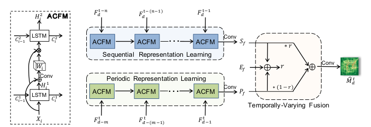

# Attentive Crowd Flow Machines



This is a PyTorch implementation of Attentive Crowd Flow Machines in the following paper: \
Liu, Lingbo, et al. "Attentive Crowd Flow Machines." 2018 ACM Multimedia Conference on Multimedia Conference. ACM, 2018.

Paper Link: https://arxiv.org/abs/1809.00101

## Requirements
- torch==0.4.1

## Model Training
```bash
# TaxiBJ
python run_taxibj.py

# BikeNYC
python run_bikenyc.py

# TaxiNYC
python run_taxinyc.py
```

## Run the Pre-trained Model
```bash
# TaxiBJ
python test_taxibj.py

# BikeNYC
python test_bikenyc.py

# TaxiNYC
python test_taxinyc.py
```

